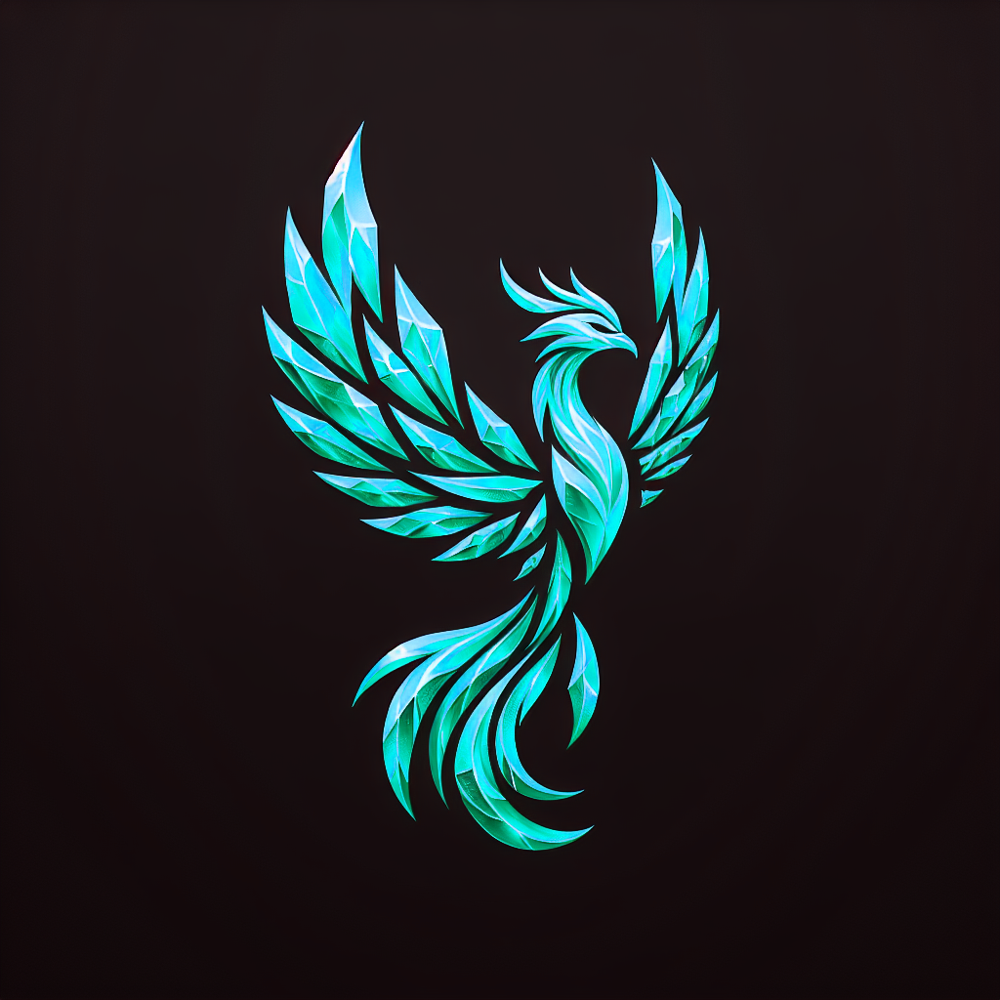

<h1 style="text-align:center;">Welcome to Chrez Bot</h1>

<!-- image -->

    

A Crystal Phoenix's guild discord app & node-based API

## Installing

### prerequisite:

Here's what you need to install a fully fledged chrezbot

- Supabase database & storage (you need the same database ERD as shown in the `models` file)
- Chrezbot video player that requires both [yt-dlp](https://github.com/yt-dlp/yt-dlp) and [ffmpeg](https://www.ffmpeg.org/), you need to install these program to play audio.

## Environtment Configuration

the environtment example and descriptions can be found at `~/env.example`

## Chrez Bot Command Lists

- `npm run test`: run test.js (unavailable in production or github)
- `npm run test:ts`: run test.ts (unavailable in production or github)
- `npm run devstart`: run Chrezbot.ts using `ts-node` (with debug)
- `npm run devstart:build`: transpile to Chrezbot.js and then run (output location is in /output)
- `npm start`: build and run the transpiled code
- `npm run build`: transpile the code without running
- `npm run loadSlashCommands`: loads slash commands
